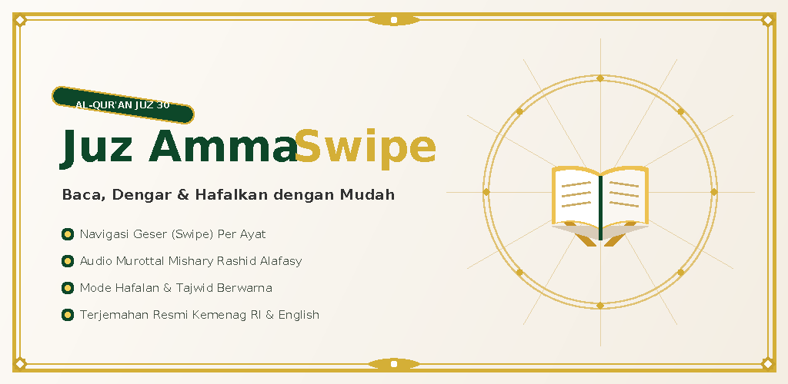

# Juz Amma Swipe (جزء عم) 📖✨

A modern, tactile, and intuitive Android Quran recitation and memorization app for **Juz 30 (Juz 'Amma)**, built entirely with **Kotlin** and **Jetpack Compose**.

<p align="center">
  
</p>

---

## 🌟 Key Features

- **👉 Swipe-by-Ayah Navigation**: Fluid, tactile horizontal swiping from verse to verse, designed for immersive focused reading without distraction.
- **🔊 Mishary Rashid Alafasy Audio Murottal**: High-quality streaming audio recitation for each ayah with auto-play, looping, and replay controls.
- **🎨 Interactive Tajweed Highlighting**: Distinctive color-coded Tajweed rules for students and learners (Ghunnah, Ikhfa, Idgham, Qalqalah, Madd, etc.).
- **🧠 Hifz (Memorization) Mode**: Tap-to-reveal Quranic text to test your recall during daily memorization and muraja'ah practice.
- **🇮🇩 Bilingual Translation & Transliteration**:
  - Official Indonesian Translation from **Kementerian Agama Republik Indonesia (Kemenag RI)**.
  - English Translation & clear phonetic Latin transliteration.
- **📑 Bookmarks & Last Read Tracker**: Quick one-tap bookmarking to resume your daily recitation right where you left off.
- **🌙 Material Design 3 UI**: Dynamic theme support with gorgeous Islamic emerald tones, smooth animations, and edge-to-edge layout.

---

## 📱 Tech Stack & Architecture

- **Language:** Kotlin 100%
- **UI Toolkit:** [Jetpack Compose](https://developer.android.com/jetpack/compose) with Material Design 3 (M3)
- **Audio Engine:** [AndroidX Media3 (ExoPlayer)](https://developer.android.com/guide/topics/media/media3)
- **Architecture:** Clean MVVM (Model-View-ViewModel) + Single Source of Truth
- **Asynchronous Flow:** Kotlin Coroutines & StateFlow
- **Design:** Adaptive layout, edge-to-edge support, custom vector icons

---

## 🚀 Getting Started

### Prerequisites
- **Android Studio Ladybug (2024.2.1)** or newer
- **JDK 17** or higher
- **Android SDK:**
  - `minSdk`: 26 (Android 8.0 Oreo)
  - `targetSdk`: 34 (Android 14) / 35

### Cloning & Building
1. Clone the repository:
   ```bash
   git clone https://github.com/<your-username>/juz-amma-swipe.git
   cd juz-amma-swipe
   ```
2. Open the project in **Android Studio**.
3. Allow Gradle to sync dependencies.
4. Run on an Android device or emulator (`Shift + F10`).

---

## 📁 Project Structure

```
├── app/
│   ├── src/main/
│   │   ├── java/com/example/         # Kotlin MVVM source code
│   │   │   ├── ui/                   # Jetpack Compose screens, components & theme
│   │   │   ├── data/                 # Models, Surah data & repository
│   │   │   └── player/               # Media3 ExoPlayer audio service
│   │   └── res/                      # Drawables, mipmaps, strings, XML resources
├── play_store_assets/                # 512x512 icon & 1024x500 feature graphic
├── build.gradle.kts                  # Root build configuration
└── settings.gradle.kts               # Module and repository definitions
```

---

## 📄 License & Attribution
- Quran text and translations sourced from official verified open datasets.
- Audio recitations by Sheikh Mishary Rashid Alafasy.
